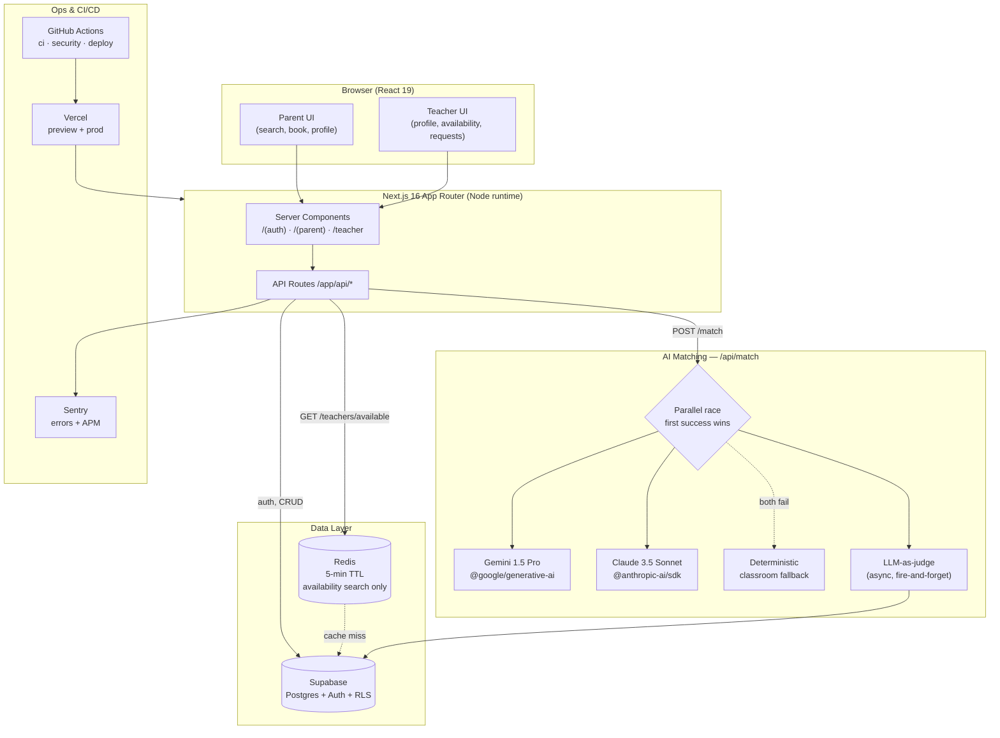

# TeachSitter

**Connect preschool parents with their school's teachers for trusted break-time childcare.**

TeachSitter closes a recurring childcare gap during school breaks (winter, spring, summer, Thanksgiving) by connecting working parents with the very teachers who already know their children. Teachers post availability, parents search and book, and a dual-AI matching engine ranks teachers by classroom familiarity and schedule fit.

---

## Architecture



**Key architectural choices**

- **Monolith-first.** All server code lives in Next.js API routes — no microservices.
- **Node runtime only.** Edge runtime is incompatible with Supabase, ioredis, and the AI SDKs.
- **RLS everywhere.** Row-level security policies are required on every table before API exposure.
- **AI is server-side.** Model keys never touch the client; all `/api/match` calls run in Node.
- **Cache sparingly.** Redis is used only for teacher-availability search (5-min TTL). Supabase is the source of truth.
- **Eval-driven.** Every AI match is logged to `match_evals`, and an LLM judge asynchronously scores ranking quality on a 0–10 scale.

---

## Tech Stack

| Layer            | Technology                                                    |
| ---------------- | ------------------------------------------------------------- |
| Frontend         | Next.js 16 (App Router), React 19, Tailwind CSS v4, Shadcn UI |
| Backend          | Node.js via Next.js API Routes                                |
| Database & Auth  | Supabase (Postgres, RLS, Email + Password)                    |
| Caching          | Redis via ioredis                                             |
| AI / Matching    | Gemini 1.5 Pro + Claude 3.5 Sonnet (parallel race)            |
| Validation       | Zod                                                           |
| Testing          | Vitest + Playwright + fast-check                              |
| Monitoring       | Sentry (errors + APM)                                         |
| Security (CI)    | CodeQL (SAST), npm audit (SCA), OWASP ZAP (DAST)              |
| Security (local) | eslint-plugin-security via lint-staged                        |
| Git hooks        | Husky + lint-staged                                           |
| CI/CD            | GitHub Actions → Vercel                                       |

---

## Features

**Authentication** — Email + password via Supabase, role selection (parent or teacher) at signup, protected routes by role.

**Teacher** — Create profile (classroom, bio, expertise, hourly rate), post date-range availability, confirm or decline incoming booking requests.

**Parent** — Add child (classroom, age), search teachers by date range + classroom + name, view AI-ranked matches with reasoning, send booking requests, track booking status.

**AI Matching** — `POST /api/match` races Gemini and Claude; first successful response wins. Falls back to a deterministic classroom-match ranker if both providers fail. Every call logs input/output to `match_evals`; an async Gemini judge scores the ranking (0–10) without blocking the response.

**Eval System** — `GET /api/evals` exposes historical match records and judge scores for admin review and metric tracking (target average ≥ 7/10).

---

## Getting Started

### Prerequisites

- Node.js 20+
- A Supabase project (free tier works)
- Redis (local via Docker: `docker run -p 6379:6379 redis`)
- Gemini API key and Anthropic API key

### Install

```bash
npm install
cp .env.example .env.local   # fill in keys below
```

### Environment variables

```
NEXT_PUBLIC_SUPABASE_URL        # Supabase project URL
NEXT_PUBLIC_SUPABASE_ANON_KEY   # Supabase anon key
SUPABASE_SERVICE_ROLE_KEY       # Supabase service role (server only)
REDIS_URL                       # redis://localhost:6379
NEXT_PUBLIC_SENTRY_DSN          # Sentry DSN (optional in dev)
GEMINI_API_KEY                  # Google Gemini key(s) — comma-separated supported
ANTHROPIC_API_KEY               # Anthropic key
```

### Database

Migrations live in `supabase/migrations/` (`001_init.sql` through `008_children_notes.sql`). Apply them with the Supabase CLI or paste them into the SQL editor. Seed with:

```bash
npm run db:seed
```

### Run

```bash
npm run dev     # http://localhost:3000
```

---

## Scripts

```bash
npm run dev              # Start dev server
npm run build            # Production build
npm run start            # Start production server
npm run lint             # ESLint + Prettier — run before PR
npm run test             # Vitest unit/integration
npm run test:e2e         # Playwright E2E
npm run test:coverage    # Coverage (target >80%)
npm run db:seed          # Seed Supabase with demo data
```

---

## Project Structure

```
/app
  /api                    API routes (auth · teachers · match · bookings · children · evals)
  /(auth)                 Login + signup pages
  /(parent)               Parent dashboard, search, bookings, profile, teacher detail
  /teacher                Teacher dashboard, setup, requests
/components
  /ui                     Shadcn UI primitives
  /features               Feature-specific components
/lib
  /supabase               Supabase client (browser + server)
  /redis                  ioredis client + cache helpers
  /ai                     Gemini ranker + judge, deterministic fallback
  /api                    Route-handler logic (kept thin in /app/api)
  /validations            Zod schemas — single source of truth
/types                    Shared TypeScript types
/supabase/migrations      Postgres schema evolution
/e2e                      Playwright specs + global setup
/scripts                  Seed + utility scripts
/docs                     PRD, API spec, mockups, session logs, demo script
/.github/workflows        ci.yml · security.yml · deploy.yml · ai-review.yml
```

---

## Database Schema

| Table          | Purpose                                                                     |
| -------------- | --------------------------------------------------------------------------- |
| `profiles`     | Users — id, email, role (`parent` \| `teacher`), full_name                  |
| `teachers`     | Teacher profile — user_id, classroom, bio, expertise, hourly_rate, position |
| `availability` | Teacher date ranges — start_date, end_date, start_time, end_time, is_booked |
| `children`     | Parent's kids — parent_id, name, classroom, age, notes                      |
| `bookings`     | Parent↔teacher requests — status (`pending` \| `confirmed` \| `declined`)   |
| `match_evals`  | Every `/api/match` call — ranked_teachers (JSON) + async judge_score (0–10) |

Every table has RLS policies enforcing role- and ownership-based access.

---

## API Overview

| Method | Route                                        | Auth    |
| ------ | -------------------------------------------- | ------- |
| POST   | `/api/auth/signup` · `/login` · `/logout`    | Public  |
| GET    | `/api/teachers/available`                    | Parent  |
| GET    | `/api/teachers/[id]`                         | Auth    |
| PATCH  | `/api/teachers/[id]`                         | Teacher |
| POST   | `/api/teachers/[id]/availability`            | Teacher |
| DELETE | `/api/teachers/[id]/availability/[avail_id]` | Teacher |
| POST   | `/api/match`                                 | Parent  |
| POST   | `/api/bookings`                              | Parent  |
| PATCH  | `/api/bookings/[id]`                         | Teacher |
| GET    | `/api/evals`                                 | Admin   |

Full request/response schemas and error codes are documented in [`docs/API.md`](docs/API.md).

---

## Testing

Strict TDD: write tests first (RED), implement the minimum (GREEN), then refactor.

- **Vitest** for unit + integration (happy-dom env, `@` path alias)
- **Playwright** for E2E (Chromium, sequential, screenshots on failure)
- **fast-check** for property-based tests on complex logic (AI ranking, validation, permissions)
- Mock all Supabase and AI calls in unit tests; target **>80% coverage** enforced in CI

---

## CI/CD

| Workflow        | Trigger                             | Jobs                                    |
| --------------- | ----------------------------------- | --------------------------------------- |
| `ci.yml`        | push `feature/**`, PR to `main`     | lint → test (coverage) → build          |
| `security.yml`  | push `feature/**`, weekly Mon 03:00 | CodeQL (SAST), npm audit (SCA)          |
| `deploy.yml`    | PR to `main`, push to `main`        | Vercel preview (PR) + production (main) |
| `ai-review.yml` | PR events                           | AI-assisted code review                 |

Branch protection is enforced on `main`. Secrets live in GitHub Actions and Vercel dashboards only — never committed.

---

## Documentation

- [`docs/PRD.md`](docs/PRD.md) — Product requirements, personas, success metrics
- [`docs/API.md`](docs/API.md) — Full endpoint spec with request/response shapes
- [`docs/mockups/`](docs/mockups/) — Approved UI designs (color tokens, typography)
- [`docs/demo-script.md`](docs/demo-script.md) — End-to-end demo walkthrough
- [`docs/sessions/`](docs/sessions/) — Session logs (EXPLORE · PLAN · IMPLEMENT)
- [`CLAUDE.md`](CLAUDE.md) — Guidance for Claude Code contributors

---

## Success Metrics

| Metric                       | Target   |
| ---------------------------- | -------- |
| AI match judge score (avg)   | ≥ 7 / 10 |
| Booking confirmation rate    | ≥ 60%    |
| Search-to-request conversion | ≥ 40%    |
| Test coverage                | ≥ 80%    |
| CI pipeline pass rate        | ≥ 95%    |
| API response time (p95)      | ≤ 500ms  |

---

## License

Coursework — CS7180, Northeastern University, Spring 2026.
