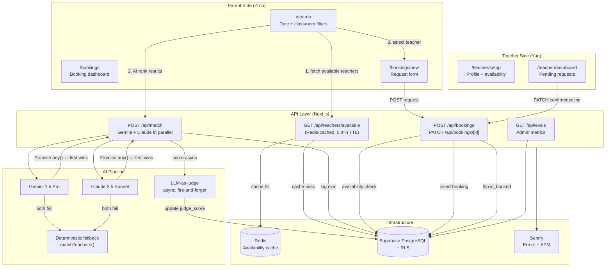

# Building the Parent Side of TeachSitter — Search, AI Matching, and What It Actually Means to Develop with Claude Code

_Author: Zixin Lin_

My teammate Yun Feng walked you through the trust infrastructure and the teacher experience. I own the other half: the parent journey from search to booked, the AI pipeline that ranks teachers, the eval system that scores those rankings, and everything that makes the whole thing ship reliably. This post is about those pieces — and honestly, just as much about what it felt like to build a production app _inside_ an AI-native development workflow.

---

## 5. System Architecture

Before diving into features, here's how all the pieces connect. Yun's half (auth, teacher API, RLS) is on the left; mine (parent UI, AI matching, bookings, evals) is on the right — they converge at the database and the `/api/match` pipeline.



The flow a parent experiences in the UI maps one-to-one to three API calls: fetch teachers, rank them with AI, submit a request. The complexity lives in the middle column — particularly the AI pipeline, which has to be fast, observable, and never the reason a parent sees an error page.

---

## 6. The Parent Search Experience

The search page (`/search`) does two things in sequence: fetch available teachers from the database, then pass them through AI ranking. I deliberately split these into separate async steps rather than doing them server-side in one shot.

**Why split?** If AI ranking took 3 seconds and I blocked the page render on it, parents would stare at a spinner for 3 seconds on every search. Instead, the page loads with the deterministic database results immediately, then the AI ranking overlays on top once it resolves. The UX pattern — show something useful now, upgrade it when ready — mirrors how good UX handles any slow async dependency.

The filter bar accepts start and end dates, a classroom name, and a teacher name. Every filter is optional except the date range. The query hits `GET /api/teachers/available`, which runs a Supabase join across `teachers`, `availability`, and `profiles`, filtered by date overlap and `is_booked = false`. That result is Redis-cached per query key with a 5-minute TTL. If Redis is unavailable — network blip, restart, doesn't matter — the API fails open and queries the database directly. Caching is an optimization, not a dependency.

Teacher cards show name, classroom, bio, availability windows, hourly rate, and — once AI ranking completes — a rank badge and a one-sentence reasoning string ("Same classroom as child — highest familiarity."). The reasoning is the part parents actually care about; it closes the loop between "the app ranked this person first" and "here's why you can trust that."

---

## 7. The AI Matching Pipeline

`POST /api/match` is the most interesting route in the codebase, and also the most constrained. A few design decisions made the constraint manageable.

**Parallel race, not sequential fallback.** Gemini 1.5 Pro and Claude 3.5 Sonnet run simultaneously via `Promise.any()`. Whichever responds first wins; the other is dropped. If both fail, `matchTeachers()` — a deterministic function that ranks by classroom match, then bio completeness — takes over. This means the endpoint never returns a 502. The client always gets a ranked list; the quality of the ranking degrades gracefully under provider outages.

**Eval logging before response, judge scoring after.** Every call inserts a row into `match_evals` synchronously, before returning to the caller. The LLM-as-judge step — which sends the ranked result back to Gemini with the prompt "Given this parent's needs and these teachers, is the ranking reasonable? Score 0–10 with reasoning." — fires asynchronously with no await. The `judge_score` column starts null and fills in seconds later. This means response latency stays low (the client doesn't wait for the judge) while every match is still scored in the background for metrics.

**Prompt injection guards.** Teacher bios flow directly into the AI prompt. A bio field capped at 2000 characters and validated by Zod before hitting the AI layer is a meaningful defense against prompt injection — not sufficient on its own, but it raises the cost of an attempt. The booking message field has the same treatment (500 chars, Zod-validated). The CLAUDE.md for this project explicitly flags this pattern: "Sanitize input before AI calls."

The `GET /api/evals` endpoint exposes the logged results to admin users — paginated, newest first, with judge scores. The average judge score across all matches (target: ≥ 7/10) is the primary quality metric for the AI pipeline. It's a tighter feedback loop than A/B testing: every match is scored, not just the ones a parent acts on.

---

## 8. The Booking Flow

Three pages, three API calls, one state machine.

**Search → `/bookings/new`.** When a parent taps "Book" on a teacher card, the search page encodes `teacher_id`, `teacher_name`, `classroom`, `start_date`, and `end_date` into the URL and navigates to `/bookings/new`. The booking form reads those query params to pre-fill the teacher summary card and date inputs — so the parent doesn't have to re-enter anything they already decided. The only required input they provide is an optional 500-character message.

**`POST /api/bookings` — the availability check.** Before inserting a booking, the route checks that an `availability` row exists for the teacher that fully covers the requested date range and is not yet booked. If no matching slot exists, it returns 409. This check is redundant with the Redis-cached search results, but I treat it as a server-side invariant: client-side state can drift (cache expiry, another parent books the same slot between search and submit), and the API layer is the final authority.

**Booking dashboard (`/bookings`).** The parent's booking history is split into three sections: confirmed upcoming sessions, pending requests, and past history. Each card has "Modify" and "Cancel" actions. Modify opens a modal to change dates and message; the API resets status to `pending` on a date change, which re-triggers the teacher's confirmation flow. Cancel soft-deletes the booking (only allowed while `pending`). State updates are applied optimistically — the card moves or disappears before the server responds — to keep the UI feeling responsive.

---

## 9. Developing with Claude Code — The Part That Surprised Me

I came into this project expecting to use Claude Code as an autocomplete engine. What I got was closer to a pair programmer who happens to be available at 2am and never complains about reviewing test output.

**The Writer/Reviewer pattern.** For nearly every feature, I ran two Claude Code passes: a first pass where I described the feature and Claude generated the implementation, and a second pass where I asked it to review its own code for security issues, edge cases, and spec compliance. The second pass caught real things — an off-by-one on date overlap validation, a missing 404 branch in the evals endpoint, a prompt injection vector in the bio field. Human review still ran after both passes, but the two-Claude-pass approach dramatically reduced what I needed to catch myself.

The ratio in practice: Claude Code wrote roughly 70% of the code by volume. I wrote the integration seams, made the architectural calls, and caught the things that required understanding the system as a whole rather than one file at a time.

**Hooks as non-negotiable CI.** The five hooks Yun described aren't just quality gates — they changed how I worked. The auto-Prettier hook on every edit meant I stopped thinking about formatting entirely; it became invisible. The pre-push hook (lint → test → build) meant I never pushed a broken commit to a feature branch, because the push would just block. The Stop hook — running the full test suite when Claude finishes a task — meant I always knew the exact state of the test suite before I moved on. Together they shifted "did I break anything?" from a question I asked manually to a property the environment guaranteed.

**The `issue-plan` skill.** For every non-trivial feature — search, AI matching, evals — I ran `/issue-plan` first. The skill fetches the GitHub issue, explores the codebase, and produces a structured implementation plan before any code is written. This meant I never opened a new feature branch without a clear picture of which files needed to change, which tests needed to be written first, and which edge cases were worth handling. It's a forcing function for doing the design before the implementation.

**MCP for GitHub.** The GitHub MCP server (`mcp__github__*` tools) let Claude Code read issue comments, check PR review status, and post updates without leaving the terminal. During the evals feature, I asked Claude to check issue #19 for acceptance criteria while I was implementing — it fetched the issue, extracted the criteria, and flagged two things my implementation was missing. That feedback loop (GitHub issue → implementation gap → code fix) happened in one session without a browser tab.

---

## 10. TDD in Practice — Red, Green, Refactor

The CLAUDE.md for this project mandates strict TDD: write failing tests first, confirm they fail (RED), implement the minimum code to pass (GREEN), then clean up (REFACTOR). I followed this for every API route on the parent side. Here's what it looked like for `/api/match`:

**RED.** I wrote 13 tests covering auth (parent-only), input validation (teachers array 1–50 items, date ordering, bio max 2000 chars), the AI race (Gemini wins, Gemini fails + Claude wins, both fail → deterministic), eval logging, and response shape. `npm run test -- api-match.test.ts` showed 13 failing tests. Commit: `test(RED): #19 POST /api/match — auth, validation, AI race, eval logging`.

**GREEN.** I implemented `app/api/match/route.ts` — Zod validation, `Promise.any()` race, admin client insert for `match_evals`, fire-and-forget judge. All 13 tests pass. Commit: `feat(GREEN): #19 POST /api/match — parallel AI race with eval logging`.

**REFACTOR.** I extracted `runMatch()` to `lib/api/match.ts` so the route handler stayed thin, and moved the deterministic fallback into `lib/ai/match.ts` so it could be tested in isolation. Commit: `refactor(REFACTOR): #19 extract runMatch() and matchTeachers() to lib`.

The RED commit is the important one. It forces you to think about the contract before the implementation, and it produces a test suite that documents the intended behavior independent of the code. When I went back two weeks later to add the parent booking-modification path to `PATCH /api/bookings/[id]`, the existing tests were the authoritative spec — they told me exactly what the route was supposed to do.

---

## 11. Security as a Checklist, Not an Afterthought

The CLAUDE.md lists security requirements explicitly, and the CI pipeline enforces them.

**What runs on every feature branch push:**

- `eslint-plugin-security` at pre-commit (lint-staged) — catches single-file patterns like `eval()`, `innerHTML`, regex DoS.
- CodeQL (SAST) in GitHub Actions — cross-file taint analysis that catches things ESLint can't, like user input flowing unsanitized into a query.
- `npm audit --audit-level=high --omit=dev` — blocks merge on high/critical dependency vulnerabilities.
- OWASP ZAP passive scan runs against every Vercel preview deploy.

**What this caught in practice.** CodeQL flagged a path in the `/api/teachers/available` handler where the `name` query parameter was interpolated into a Supabase filter without `encodeURIComponent`. CLAUDE.md is explicit: "`encodeURIComponent` on all user-controlled values placed in URLs (including date inputs)." The fix was one line. The habit it reinforced — check every query param before it touches a URL — is worth more than the fix.

The rule for CodeQL findings is also explicit in CLAUDE.md: **fix the code, do not dismiss the alert.** Dismissing signals "known issue, won't fix." Every finding in this project was fixed at the code level before merge.

---

## 12. The CI/CD Pipeline

Four GitHub Actions workflows. The branching model is `feature/[issue-id]-[slug]` → `main`; nothing goes to main without passing CI.

```
feature branch push
      │
      ├── ci.yml
      │     ├── Lint (ESLint + Prettier check)
      │     ├── Test (Vitest, coverage artifact uploaded)
      │     └── Build (Next.js production build)
      │
      └── security.yml
            ├── CodeQL (SAST, javascript-typescript)
            └── npm audit (--audit-level=high)

PR to main
      └── deploy.yml
            └── Vercel preview deploy
                  └── OWASP ZAP passive scan
                        └── Preview URL posted to PR

Merge to main
      └── deploy.yml
            └── Vercel production deploy

Weekly (Monday 03:00 UTC)
      └── security.yml (scheduled CodeQL + audit re-run)
```

The `ai-review.yml` workflow runs on every PR to main, triggering a Claude Code review via `anthropics/claude-code-action@beta`. It reads the diff, checks against the CLAUDE.md conventions (naming, Zod validation, no `any`, RLS coverage), and posts a structured review comment. This is the C.L.E.A.R. framework operationalized: the AI reviewer checks Code quality, catches Logic errors, confirms Expectations from the spec are met, flags Accessibility gaps, and surfaces Risks. It doesn't replace human review — it makes human review faster by pre-triaging the obvious issues.

The entire pipeline runs in under 4 minutes on a warm runner. `npm ci` with a lock file keeps installs deterministic. Coverage is uploaded as an artifact for 7 days; the target (>80%) is enforced by CI.

---

## 13. What I'd Do Next

Two things I'd add before this scales:

**Booking overlap validation at the DB layer.** Right now the availability check in `POST /api/bookings` is application-level — it queries for a matching `availability` row and returns 409 if none exists. Under concurrent load, two parents could both read "available" and both attempt to book the same slot within the same millisecond. A Postgres partial unique index on `(teacher_id, start_date, end_date) WHERE is_booked = false` would make double-booking structurally impossible rather than probabilistically unlikely.

**Real-time eval score display.** The `judge_score` column fills in seconds after a match call returns, but the parent never sees it update. Supabase's Postgres changefeeds (Realtime) could push the score update to the eval dashboard the moment the judge job completes — no polling, no stale state. It's a one-afternoon integration; the infrastructure is already there.

---

## Closing Thoughts

The thing that surprised me most about building TeachSitter with Claude Code wasn't the code it wrote — it's the scaffolding it made easy to maintain. The hooks, the skills, the session logs, the CLAUDE.md conventions: all of it together meant that context didn't disappear between sessions. When I came back to a feature branch after two days, I could read `docs/sessions/IMPLEMENT_*.md` and pick up exactly where I left off. That's not an AI capability — it's a project discipline that Claude Code made low-friction enough to actually follow.

The bones of TeachSitter are solid. The two halves — Yun's trust layer and teacher experience, my search and AI pipeline — fit together at the database and the `withApiHandler` wrapper without surprising each other. That's what good interface contracts get you.
