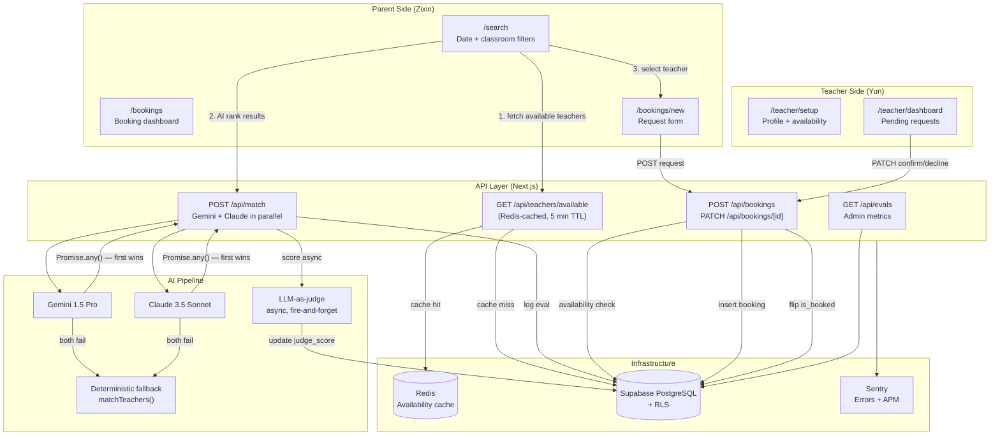

# Building TeachSitter: A Full-Stack Marketplace with Dual-AI Matching and Claude Code

_Authors: Yun Feng and Zixin Lin_

TeachSitter is a two-sided marketplace that connects preschool parents with their own child's teacher for babysitting during school breaks. We split the product down the middle: Zixin took the parent-facing search, AI matching, and eval pipeline; Yun took everything the teacher sees, plus the foundations that keep the app honest — auth routing, row-level security, observability, and the Claude Code hooks that enforce quality on every commit.

This post is a tour of how the pieces fit together, the decisions behind them, and — honestly — just as much about what it felt like to build a production app inside an AI-native development workflow.

---

## 1. System Architecture

Before diving into features, here's how everything connects. Yun's half (auth, teacher API, RLS) sits on the left; Zixin's half (parent UI, AI matching, bookings, evals) sits on the right. They converge at the database and the `/api/match` pipeline.



A parent's journey maps one-to-one to three API calls: fetch teachers, rank them with AI, submit a request. The complexity lives in the middle column — particularly the AI pipeline, which has to be fast, observable, and never the reason a parent sees an error page.

---

## 2. The Trust Layer — Middleware, RLS, Sentry

A marketplace lives or dies by whether users can only see and do what they're allowed to. Yun built that in three layers.

**Route protection middleware.** Next.js 15 App Router lets you put a single `middleware.ts` at the edge of every request. Ours reads the Supabase SSR session, pulls `role` from `user.user_metadata`, and enforces three rules: unauthenticated users hitting `/dashboard`, `/search`, `/bookings`, `/profile`, or `/teacher/*` get redirected to `/login`; parents landing on `/teacher/*` bounce to `/dashboard`; teachers landing on parent routes bounce to `/teacher/dashboard`. API routes under `/api/*` (except `/api/auth/*`) return `401` instead of redirecting, so the client can handle it cleanly. The unit tests cover all three states — anonymous, parent, teacher — because getting this wrong is how you leak data.

**RLS smoke tests and schema verification.** Middleware can be bypassed; the database cannot. Every one of the six tables — `users`, `teachers`, `availability`, `children`, `bookings`, `match_evals` — has RLS enabled with policies that enforce, for example, "a teacher can only update `bookings` where `teacher_id = auth.uid()`" and "`match_evals` is write-only for authenticated users, read-only for service role." We wrote integration smoke tests that log in as different users and assert each policy actually blocks cross-user reads and writes, plus a seed script (`npm run db:seed`) that spins up two parents, three teachers, availability blocks, and one booking each.

**Sentry.** Errors and slow paths needed to surface without grepping logs. We integrated `@sentry/nextjs` with both `sentry.client.config.ts` and `sentry.server.config.ts`, and wired performance transactions into every API route via the shared `withApiHandler` wrapper in `lib/errors.ts`. Alert thresholds: error spikes, p95 > 500ms on general routes, p95 > 1000ms on `/api/match`. `SENTRY_DSN` lives in env only and is documented in `.env.example`.

---

## 3. The Teacher Experience

The teacher side is four pieces working together. The API and UI were built in parallel on separate feature branches, then stitched.

**Availability management API.** Four endpoints: `GET /api/teachers/[id]` loads profile plus availability; `PATCH /api/teachers/[id]` updates classroom/bio/expertise; `POST /api/teachers/[id]/availability` adds a block; `DELETE /api/teachers/[id]/availability/[avail_id]` removes one. Every input is validated with Zod — `start_date` and `end_date` as ISO 8601 strings, `end_date >= start_date`, `classroom` max 100 chars, `bio` max 1000. Every mutating route checks both `user.role === 'teacher'` and ownership (`teacher.user_id === auth.uid()`), so RLS is the second line of defense, not the first.

**Profile setup page.** `/teacher/setup` is a two-column layout — a profile form card on the left with a circular photo uploader, classroom input, bio textarea, and toggleable expertise pills (Art & Crafts, STEM Activities, Music & Dance, and four others); a sticky sidebar on the right for availability blocks. On submit it `PATCH`es the profile API. The form is required-by-default: you can't save without a classroom and at least one availability block, because an empty teacher profile is worse than no profile at all.

**Dashboard and Requests.** `/teacher/dashboard` shows a personalized greeting with an animated `animate-ping` availability dot, two stat cards (upcoming sessions, pending requests), and a grid: confirmed bookings on the left, a sticky pending-request sidebar with Accept/Decline buttons on the right. `/teacher/requests` is the deeper view — full booking history with a modal that opens parent info, child details, and a cancel-with-reason flow. Both pages do optimistic UI updates on Accept/Decline so the card moves or disappears before the server round-trip completes.

**Confirm/decline API.** `PATCH /api/bookings/[id]` takes `{ status: "confirmed" | "declined" }` and — the non-obvious part — flips the corresponding `availability.is_booked` to `true` when a booking is confirmed. That side effect is what keeps parent search honest: a teacher with two confirmed bookings stops showing up as available for those dates. Error shape: `400` invalid status, `401` anonymous, `403` not-the-teacher, `404` missing booking, all routed through `withApiHandler`.

---

## 4. The Parent Search Experience

The search page (`/search`) does two things in sequence: fetch available teachers from the database, then pass them through AI ranking. We deliberately split these into separate async steps rather than doing them server-side in one shot.

**Why split?** If AI ranking took 3 seconds and we blocked the page render on it, parents would stare at a spinner for 3 seconds on every search. Instead, the page loads with the deterministic database results immediately, then the AI ranking overlays on top once it resolves. The UX pattern — show something useful now, upgrade it when ready — mirrors how good UX handles any slow async dependency.

The filter bar accepts start and end dates, a classroom name, and a teacher name. Every filter is optional except the date range. The query hits `GET /api/teachers/available`, which runs a Supabase join across `teachers`, `availability`, and `profiles`, filtered by date overlap and `is_booked = false`. That result is Redis-cached per query key with a 5-minute TTL. If Redis is unavailable — network blip, restart, doesn't matter — the API fails open and queries the database directly. Caching is an optimization, not a dependency.

Teacher cards show name, classroom, bio, availability windows, hourly rate, and — once AI ranking completes — a rank badge and a one-sentence reasoning string ("Same classroom as child — highest familiarity."). The reasoning is the part parents actually care about; it closes the loop between "the app ranked this person first" and "here's why you can trust that."

---

## 5. The AI Matching Pipeline

`POST /api/match` is the most interesting route in the codebase, and also the most constrained. A few design decisions made the constraint manageable.

**Parallel race, not sequential fallback.** Gemini 1.5 Pro and Claude 3.5 Sonnet run simultaneously via `Promise.any()`. Whichever responds first wins; the other is dropped. If both fail, `matchTeachers()` — a deterministic function that ranks by classroom match, then bio completeness — takes over. This means the endpoint never returns a 502. The client always gets a ranked list; the quality of the ranking degrades gracefully under provider outages.

**Eval logging before response, judge scoring after.** Every call inserts a row into `match_evals` synchronously, before returning to the caller. The LLM-as-judge step — which sends the ranked result back to Gemini with the prompt _"Given this parent's needs and these teachers, is the ranking reasonable? Score 0–10 with reasoning."_ — fires asynchronously with no await. The `judge_score` column starts null and fills in seconds later. Response latency stays low (the client doesn't wait for the judge) while every match is still scored in the background for metrics.

**Prompt injection guards.** Teacher bios flow directly into the AI prompt. A bio field capped at 2000 characters and validated by Zod before hitting the AI layer is a meaningful defense against prompt injection — not sufficient on its own, but it raises the cost of an attempt. The booking message field has the same treatment (500 chars, Zod-validated). Our `CLAUDE.md` explicitly flags this pattern: "Sanitize input before AI calls."

The `GET /api/evals` endpoint exposes the logged results to admin users — paginated, newest first, with judge scores. The average judge score across all matches (target: ≥ 7/10) is the primary quality metric for the AI pipeline. It's a tighter feedback loop than A/B testing: every match is scored, not just the ones a parent acts on.

---

## 6. The Booking Flow

Three pages, three API calls, one state machine.

**Search → `/bookings/new`.** When a parent taps "Book" on a teacher card, the search page encodes `teacher_id`, `teacher_name`, `classroom`, `start_date`, and `end_date` into the URL and navigates to `/bookings/new`. The booking form reads those query params to pre-fill the teacher summary card and date inputs — so the parent doesn't have to re-enter anything they already decided. The only required input they provide is an optional 500-character message.

**`POST /api/bookings` — the availability check.** Before inserting a booking, the route checks that an `availability` row exists for the teacher that fully covers the requested date range and is not yet booked. If no matching slot exists, it returns 409. This check is redundant with the Redis-cached search results, but we treat it as a server-side invariant: client-side state can drift (cache expiry, another parent books the same slot between search and submit), and the API layer is the final authority.

**Booking dashboard (`/bookings`).** The parent's booking history is split into three sections: confirmed upcoming sessions, pending requests, and past history. Each card has "Modify" and "Cancel" actions. Modify opens a modal to change dates and message; the API resets status to `pending` on a date change, which re-triggers the teacher's confirmation flow. Cancel soft-deletes the booking (only allowed while `pending`). State updates are applied optimistically — the card moves or disappears before the server responds — to keep the UI feeling responsive.

---

## 7. Testing — E2E and TDD

**Playwright end-to-end.** Four spec files: auth rendering and navigation, teacher setup, teacher dashboard, parent booking flow (search → form). Each test spins up test users via the Supabase admin API and tears them down after. The more interesting thing here isn't the tests themselves but how they were written: Yun developed the E2E suite in parallel with the teacher-requests feature using git worktrees, which let both branches be checked out simultaneously in separate directories. Running the dev server for the requests page while writing E2E tests against it — on the same machine, same Claude Code session, no branch-switching churn — cut iteration time dramatically.

**Strict TDD on the parent side.** `CLAUDE.md` mandates RED → GREEN → REFACTOR: write failing tests first, confirm they fail, implement the minimum to pass, then clean up. Zixin followed this for every API route on the parent side. Here's what it looked like for `/api/match`:

- **RED.** 13 tests covering auth (parent-only), input validation (teachers array 1–50 items, date ordering, bio max 2000 chars), the AI race (Gemini wins, Gemini fails + Claude wins, both fail → deterministic), eval logging, and response shape. `npm run test -- api-match.test.ts` showed 13 failing tests. Commit: `test(RED): #19 POST /api/match — auth, validation, AI race, eval logging`.
- **GREEN.** Implemented `app/api/match/route.ts` — Zod validation, `Promise.any()` race, admin client insert for `match_evals`, fire-and-forget judge. All 13 tests pass. Commit: `feat(GREEN): #19 POST /api/match — parallel AI race with eval logging`.
- **REFACTOR.** Extracted `runMatch()` to `lib/api/match.ts` so the route handler stayed thin, and moved the deterministic fallback into `lib/ai/match.ts` so it could be tested in isolation. Commit: `refactor(REFACTOR): #19 extract runMatch() and matchTeachers() to lib`.

The RED commit is the important one. It forces you to think about the contract before the implementation, and it produces a test suite that documents intended behavior independent of the code. When we came back two weeks later to add parent booking modification to `PATCH /api/bookings/[id]`, the existing tests were the authoritative spec.

---

## 8. Security as a Checklist, Not an Afterthought

`CLAUDE.md` lists security requirements explicitly, and the CI pipeline enforces them.

**What runs on every feature branch push:**

- `eslint-plugin-security` at pre-commit (lint-staged) — catches single-file patterns like `eval()`, `innerHTML`, regex DoS.
- CodeQL (SAST) in GitHub Actions — cross-file taint analysis that catches things ESLint can't, like user input flowing unsanitized into a query.
- `npm audit --audit-level=high --omit=dev` — blocks merge on high/critical dependency vulnerabilities.
- OWASP ZAP passive scan runs against every Vercel preview deploy.

**What this caught in practice.** CodeQL flagged a path in the `/api/teachers/available` handler where the `name` query parameter was interpolated into a Supabase filter without `encodeURIComponent`. Our `CLAUDE.md` is explicit: "`encodeURIComponent` on all user-controlled values placed in URLs (including date inputs)." The fix was one line. The habit it reinforced — check every query param before it touches a URL — is worth more than the fix.

The rule for CodeQL findings is also explicit: **fix the code, do not dismiss the alert.** Dismissing signals "known issue, won't fix." Every finding in this project was fixed at the code level before merge.

---

## 9. Quality Gates and the Claude Code Workflow

We came into this project expecting to use Claude Code as an autocomplete engine. What we got was closer to a pair programmer who happens to be available at 2am and never complains about reviewing test output.

**Five hooks as non-negotiable CI.** `.claude/settings.json` defines hooks that run automatically during agent work:

- **Pre-push gate** (`PreToolUse` on `Bash`): blocks any `git push` unless lint + test + build all pass.
- **Protected file guard** (`PreToolUse` on `Edit`): blocks edits to `.env*` and foundational migration files.
- **Secret file guard** (`PreToolUse` on `Write`): blocks writing new env files entirely.
- **Auto-format** (`PostToolUse` on `Edit`): Prettier runs on every `.ts/.tsx/.js/.jsx` touched.
- **Quality check** (`Stop`): the full test suite runs when Claude finishes a task.

These aren't just quality gates — they changed how we worked. Auto-Prettier made formatting invisible. The pre-push gate meant no broken feature branches, because pushes would just block. The Stop hook meant we always knew the exact state of the test suite before moving on. Together they shifted "did I break anything?" from a question we asked manually to a property the environment guaranteed.

**The Writer/Reviewer pattern.** For nearly every feature, we ran two Claude Code passes: a first pass where we described the feature and Claude generated the implementation, and a second pass where we asked it to review its own code for security issues, edge cases, and spec compliance. The second pass caught real things — an off-by-one on date overlap validation, a missing 404 branch in the evals endpoint, a prompt injection vector in the bio field. Human review still ran after both passes, but the two-pass approach dramatically reduced what we needed to catch ourselves.

The ratio in practice: Claude Code wrote roughly 70% of the code by volume. We wrote the integration seams, made the architectural calls, and caught the things that required understanding the system as a whole rather than one file at a time.

**The `issue-plan` skill.** For every non-trivial feature — search, AI matching, evals — we ran `/issue-plan` first. The skill fetches the GitHub issue, explores the codebase, and produces a structured implementation plan before any code is written. This meant we never opened a new feature branch without a clear picture of which files needed to change, which tests needed to be written first, and which edge cases were worth handling. It's a forcing function for doing the design before the implementation.

**MCP for GitHub.** The GitHub MCP server (`mcp__github__*` tools) let Claude Code read issue comments, check PR review status, and post updates without leaving the terminal. During the evals feature, Zixin asked Claude to check issue #19 for acceptance criteria mid-implementation — it fetched the issue, extracted the criteria, and flagged two things the implementation was missing. That feedback loop (GitHub issue → implementation gap → code fix) happened in one session without a browser tab.

Alongside the hooks, Yun shipped teacher UX polish — auto-login after signup with role-based redirect, a booking detail modal with a cancel-with-reason flow, a sign-out button in the teacher navbar, and a schema migration adding `full_name` to profiles with a Postgres trigger to keep it synced.

---

## 10. The CI/CD Pipeline

Four GitHub Actions workflows. The branching model is `feature/[issue-id]-[slug]` → `main`; nothing goes to `main` without passing CI.

```
feature branch push
      │
      ├── ci.yml
      │     ├── Lint (ESLint + Prettier check)
      │     ├── Test (Vitest, coverage artifact uploaded)
      │     └── Build (Next.js production build)
      │
      └── security.yml
            ├── CodeQL (SAST, javascript-typescript)
            └── npm audit (--audit-level=high)

PR to main
      └── deploy.yml
            └── Vercel preview deploy
                  └── OWASP ZAP passive scan
                        └── Preview URL posted to PR

Merge to main
      └── deploy.yml
            └── Vercel production deploy

Weekly (Monday 03:00 UTC)
      └── security.yml (scheduled CodeQL + audit re-run)
```

The `ai-review.yml` workflow runs on every PR to `main`, triggering a Claude Code review via `anthropics/claude-code-action@beta`. It reads the diff, checks against the `CLAUDE.md` conventions (naming, Zod validation, no `any`, RLS coverage), and posts a structured review comment. This is the C.L.E.A.R. framework operationalized: the AI reviewer checks **C**ode quality, catches **L**ogic errors, confirms **E**xpectations from the spec are met, flags **A**ccessibility gaps, and surfaces **R**isks. It doesn't replace human review — it makes human review faster by pre-triaging the obvious issues.

The entire pipeline runs in under 4 minutes on a warm runner. `npm ci` with a lock file keeps installs deterministic. Coverage is uploaded as an artifact for 7 days; the target (>80%) is enforced by CI.

---

## 11. What We'd Do Next

The bones are solid, but three things sit on the next-up list before this scales:

**Booking overlap validation at the DB layer.** The availability check in `POST /api/bookings` is application-level — it queries for a matching `availability` row and returns 409 if none exists. Under concurrent load, two parents could both read "available" and both attempt to book the same slot within the same millisecond. A Postgres partial unique index on `(teacher_id, start_date, end_date) WHERE is_booked = false` would make double-booking structurally impossible rather than probabilistically unlikely.

**Real-time updates via Supabase changefeeds.** Two concrete wins: pushing new booking requests into the teacher dashboard without a refresh, and updating `judge_score` on the eval dashboard the moment the async judge job completes. Both are one-afternoon integrations; Supabase Realtime is already in the stack.

**Tighter AI eval loop.** Today we log every match and score it asynchronously. The next step is surfacing the rolling average judge score on a metrics page, with a breakdown by provider (Gemini vs. Claude) and by fallback usage. That turns the eval system from a monitoring tool into a provider-selection signal.

---

## Closing Thoughts

The thing that surprised us most about building TeachSitter with Claude Code wasn't the code it wrote — it's the scaffolding it made easy to maintain. The hooks, the skills, the session logs, the `CLAUDE.md` conventions: all of it together meant that context didn't disappear between sessions. When we came back to a feature branch after two days, we could read `docs/sessions/IMPLEMENT_*.md` and pick up exactly where we left off. That's not an AI capability — it's a project discipline that Claude Code made low-friction enough to actually follow.

The two halves of TeachSitter — the trust layer and teacher experience on one side, the search and AI pipeline on the other — fit together at the database and the `withApiHandler` wrapper without surprising each other. That's what good interface contracts get you, and it's what let two engineers ship a production-grade marketplace without constantly stepping on each other's feet.
